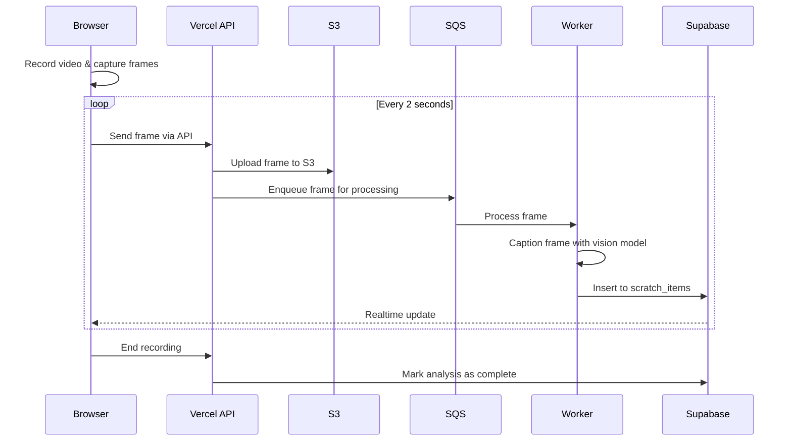

# Real-time Video Frame Analysis

This project implements real-time video frame analysis using a modern stack:

- Next.js for the frontend and API routes
- Supabase for database and real-time subscriptions
- AWS S3 for frame storage
- AWS SQS for processing queue
- Vision models for image captioning

## Architecture Overview

The system captures frames from video recordings at regular intervals, analyzes them with computer vision models, and stores the results in a database. The analysis happens in real-time, allowing for immediate feedback during video recording.



## Implementation Components

### Client-side

- `utils/frame-grabber.ts`: Utility to extract a frame from a video element
- `utils/frame-sender.ts`: Manager for sending frames at regular intervals
- `hooks/use-camera-core.ts`: Core camera hook with frame streaming support
- `hooks/use-frame-analysis.ts`: Hook for managing real-time frame analysis state
- `components/camera-capture.tsx`: Main camera UI with real-time analysis option
- `components/frame-analysis-viewer.tsx`: Component to display frame analysis results

### Server-side

- `app/api/frame/route.ts`: API route for receiving and storing frames
- `app/api/frame-process/route.ts`: API route for processing frames from SQS
- `utils/frame-processor.ts`: Worker utility for processing frames with vision models
- `migrations/20240523_add_frame_analysis.sql`: Database schema for frame analysis

### Database Schema

The database schema includes:

- `scratch_items` table for storing frame analysis data
- Fields added to the `assets` table to track frame analysis status
- Functions for managing frame analysis workflow
- Triggers for real-time notifications

## Configuration

The system is configured via environment variables:

| Variable | Description | Default |
|----------|-------------|---------|
| `NEXT_PUBLIC_FRAME_RATE_SEC` | Seconds between frame captures | `2` |
| `NEXT_PUBLIC_FRAME_WS_URL` | WebSocket endpoint for frames | `/api/frame` |
| `S3_BUCKET_NAME` | S3 bucket for storing frames | `padlox-frames` |
| `SQS_FRAME_QUEUE_URL` | SQS queue for processing frames | - |
| `VISION_API_ENDPOINT` | Endpoint for vision API | - |
| `VISION_API_KEY` | API key for vision service | - |

## Usage

To use real-time frame analysis in your application:

1. Enable the feature in the CameraCapture component:
```tsx
<CameraCapture
  onCapture={handleCapture}
  onClose={handleClose}
  realTimeAnalysis={true}
/>
```

2. Display the analysis results:
```tsx
<FrameAnalysisViewer
  assetId={assetId}
  showDownload={true}
/>
```

3. Listen for real-time updates:
```tsx
const { items, isActive } = useFrameAnalysis({
  assetId: 'your-asset-id',
  autoSubscribe: true,
});
```

## Development

1. Set up the required AWS services (S3, SQS)
2. Configure the environment variables
3. Run the database migrations
4. Start the development server

```bash
# Set up environment
cp .env.example .env.local
# Edit .env.local with your credentials

# Start development server
npm run dev
```

This is a [Next.js](https://nextjs.org) project bootstrapped with [`create-next-app`](https://nextjs.org/docs/app/api-reference/cli/create-next-app).

## Getting Started

First, run the development server:

```bash
npm run dev
# or
yarn dev
# or
pnpm dev
# or
bun dev
```

Open [http://localhost:3000](http://localhost:3000) with your browser to see the result.

You can start editing the page by modifying `app/page.tsx`. The page auto-updates as you edit the file.

This project uses [`next/font`](https://nextjs.org/docs/app/building-your-application/optimizing/fonts) to automatically optimize and load [Geist](https://vercel.com/font), a new font family for Vercel.

## Learn More

To learn more about Next.js, take a look at the following resources:

- [Next.js Documentation](https://nextjs.org/docs) - learn about Next.js features and API.
- [Learn Next.js](https://nextjs.org/learn) - an interactive Next.js tutorial.

You can check out [the Next.js GitHub repository](https://github.com/vercel/next.js) - your feedback and contributions are welcome!

## Deploy on Vercel

The easiest way to deploy your Next.js app is to use the [Vercel Platform](https://vercel.com/new?utm_medium=default-template&filter=next.js&utm_source=create-next-app&utm_campaign=create-next-app-readme) from the creators of Next.js.

Check out our [Next.js deployment documentation](https://nextjs.org/docs/app/building-your-application/deploying) for more details.

## Temporal Workflow Integration

The application integrates with Temporal for workflow management. Two workflows have been implemented:

1. A simple "Hello" workflow for testing basic Temporal infrastructure
2. A frame analysis workflow that uses Gemini 1.5 Flash for image analysis

### Running the Temporal Worker

To run the Temporal worker:

1. Make sure you have the Temporal server running locally:
   ```bash
   docker run --detach --name temporal -p 7233:7233 -p 8080:8080 temporalio/auto-setup:1.22.4
   ```

2. In a separate terminal, build and run the worker:
   ```bash
   npm run temporal:dev
   ```

   This will build the TypeScript files and start the worker in a single command.

### Testing the Hello Workflow

1. Start the Next.js development server:
   ```bash
   npm run dev
   ```

2. Navigate to the dashboard and click the "Run Hello Workflow" button in the header.

3. You should see a success toast notification.

4. Check the terminal running the worker - you should see logs indicating:
   - The workflow starting: `[Workflow] Starting helloVideoWorkflow for User`
   - The activity executing: `[Activity] Hello, User!`
   - The workflow completing: `[Workflow] Workflow completed with result: Hello, User!`

### Testing the Frame Analysis Workflow

1. Make sure the worker is running:
   ```bash
   npm run temporal:dev
   ```

2. Run the test script with sample parameters:
   ```bash
   npm run temporal:analyze-frame
   ```

   You can provide optional parameters (assetId and imageUrl):
   ```bash
   npm run temporal:analyze-frame -- 123e4567-e89b-12d3-a456-426614174000 https://example.com/your-image.jpg
   ```

3. Check the terminal running the worker - you should see logs indicating:
   - The workflow starting: `[Workflow] Starting analyzeFrame workflow for asset: ...`
   - The activity executing: `[Activity] Analyzing frame with Gemini: ...`
   - The database activity executing: `[Activity] Storing scratch item for asset: ...`
   - The workflow completing with the scratch item ID

4. You can also call the API endpoint directly:
   ```bash
   curl -X POST http://localhost:3000/api/temporal/analyze-frame \
     -H "Content-Type: application/json" \
     -d '{"assetId": "123e4567-e89b-12d3-a456-426614174000", "imageUrl": "https://example.com/your-image.jpg"}'
   ```

5. You can view all workflows in the Temporal Web UI at http://localhost:8080
