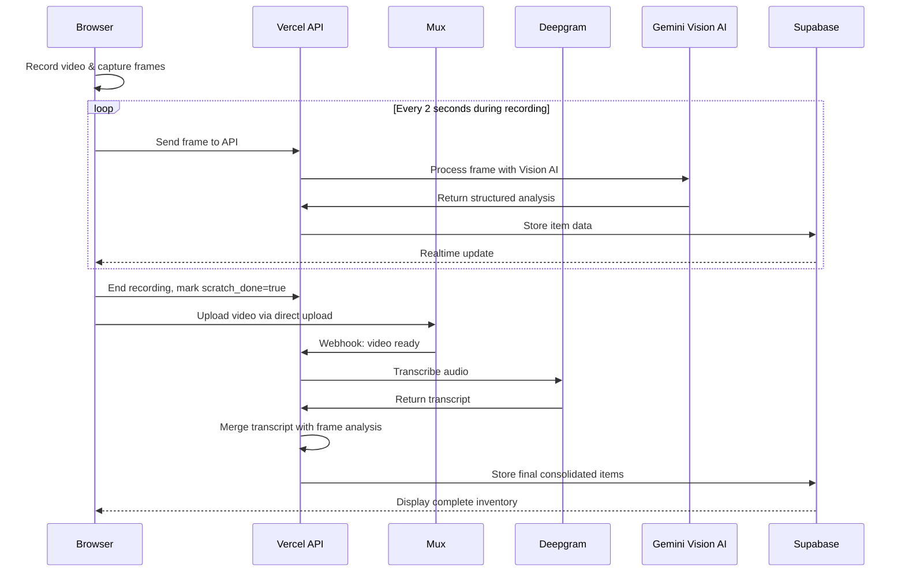

# Padlox - Home Inventory for Insurance

Padlox is a home inventory application for tracking personal possessions for insurance purposes, especially in case of disasters like fires or hurricanes. The application allows users to capture photos and videos of their belongings, which are then analyzed using AI to identify items and estimate their value.

## Core Features

- **Media Capture**: Take photos and record videos (up to ~30 minutes)
- **AI Analysis**:
  - **Videos**: Real-time frame analysis during recording + transcript generation
  - **Photos**: Image analysis to identify items
- **Dashboard**: View all captured media and the consolidated list of identified items
- **Valuation**: AI-generated estimated values for identified items
- **Content Authenticity**: Media is signed with C2PA/Adobe CAI for verification

## Technology Stack

### Frontend
- **Framework**: Next.js 15 with App Router
- **UI Components**: TailwindCSS, shadcn/ui
- **State Management**: React Context and Hooks
- **Media**: Custom camera implementation

### Backend
- **Hosting**: Vercel for the Next.js app and serverless functions
- **Database**: Supabase PostgreSQL for user data, media metadata, and analysis results
- **Media Storage**: Mux Video for video storage, processing, and streaming
- **Authentication**: Supabase Auth

### AI Services
- **Video Analysis**: 
  - Real-time frame analysis using Gemini Vision AI
  - Audio transcription using Deepgram
- **Frame + Transcript Consolidation**: Specialized LLM prompts to merge visual and audio analysis

## Architecture Overview

### Video Processing Flow



## Implementation Components

### Real-time Frame Analysis

- **Client-side**: 
  - `utils/frame-grabber.ts`: Captures frames from video element
  - `utils/frame-sender.ts`: Sends frames to API at regular intervals
  - `hooks/use-camera-core.ts`: Camera hook with frame analysis integration
  
- **Server-side**:
  - `app/api/frame/route.ts`: Receives and processes frames directly
  - `utils/frame-processor.ts`: Processes frames with Gemini Vision AI
  - `app/api/analyze-transcript/merge-with-scratch/route.ts`: Consolidates transcript with frame analysis

### Video Storage and Playback

- **Mux Integration**: Secure video storage, processing, and streaming
- **JWT Authentication**: Videos are protected with user-specific tokens
- **Custom Player**: Optimized viewing experience

## Environment Configuration

The system is configured via environment variables:

| Variable | Description | Default |
|----------|-------------|---------|
| `NEXT_PUBLIC_FRAME_RATE_SEC` | Seconds between frame captures | `2` |
| `NEXT_PUBLIC_FRAME_API_URL` | API endpoint for frames | `/api/frame` |
| `GOOGLE_GENERATIVE_AI_API_KEY` | API key for Gemini | - |
| `MUX_TOKEN_ID` | Mux API token ID | - |
| `MUX_TOKEN_SECRET` | Mux API token secret | - |
| `NEXT_PUBLIC_SUPABASE_URL` | Supabase project URL | - |
| `NEXT_PUBLIC_SUPABASE_ANON_KEY` | Supabase anonymous key | - |

## Development

```bash
# Install dependencies with pnpm
pnpm install

# Set up environment
cp .env.example .env.local
# Edit .env.local with your credentials

# Start development server
pnpm dev
```

## Mobile Testing

For testing on mobile devices:
1. Use ngrok to expose your localhost
2. Set `NEXT_PUBLIC_SITE_URL` to your ngrok URL
3. Configure Supabase redirect URLs to include your ngrok domain

See [MOBILE_TESTING_NGROK.md](./docs/MOBILE_TESTING_NGROK.md) for detailed instructions.

## Documentation

- [Architecture Overview](./docs/ARCHITECTURE.md)
- [Mux Integration](./docs/MUX_INTEGRATION.md)
- [Real-time Analysis](./docs/REAL_TIME_VIDEO.md)
- [Mobile Testing Guide](./docs/MOBILE_TESTING_NGROK.md)
