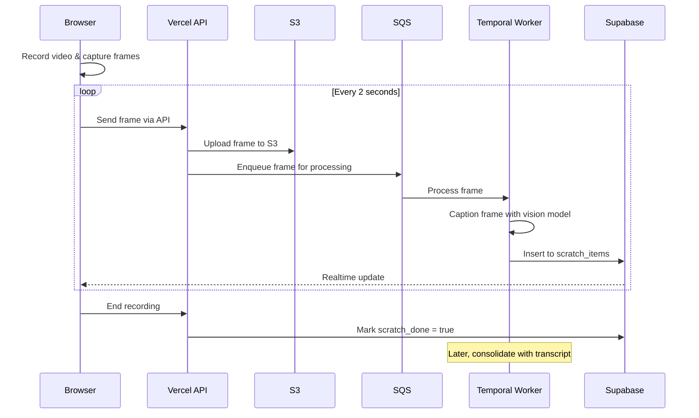

# Real-time Video Frame Analysis

This document describes the implementation of real-time frame analysis during video recording in Padlox.

## Architecture Overview

The system captures frames from the video recording at regular intervals, analyzes them, and stores metadata about each frame for later consolidation with the audio transcript.



## Implementation Components

### 1. Frame Capture (Client Side)

The frame capture is implemented in the following client-side components:

- `utils/frame-grabber.ts`: Utility to extract a frame from a video element
- `utils/frame-sender.ts`: Manager for sending frames at regular intervals
- `hooks/use-camera-core.ts`: Core camera hook with frame streaming support
- `components/camera-capture.tsx`: Main camera UI with real-time analysis option

Frame capture occurs at a configurable interval (default: 2 seconds) and sends each frame as a JPEG to the backend.

### 2. Frame Processing (Server Side)

The backend processing includes:

- `app/api/frame/route.ts`: API route for receiving and storing frames
- `utils/frame-processor.ts`: Worker utility for processing frames with BLIP-3
- `database/schema.sql`: Schema for storing frames and their analysis

### 3. Database Schema

```sql
-- Stores captured frames and their analysis
CREATE TABLE scratch_items (
  id UUID PRIMARY KEY DEFAULT gen_random_uuid(),
  session_id UUID NOT NULL REFERENCES sessions(id),
  captured_at TIMESTAMPTZ NOT NULL DEFAULT now(),
  caption TEXT,
  image_url TEXT NOT NULL,
  confidence REAL
);

-- Flag to indicate whether frame capture is complete
ALTER TABLE sessions ADD COLUMN scratch_done BOOLEAN DEFAULT FALSE;
```

## Configuration

The system is configured using environment variables:

| Variable | Description | Default |
|----------|-------------|---------|
| `NEXT_PUBLIC_FRAME_RATE_SEC` | Seconds between frame captures | `2` |
| `NEXT_PUBLIC_FRAME_WS_URL` | WebSocket endpoint for frames | `/api/frame` |
| `S3_BUCKET_NAME` | S3 bucket for storing frames | `padlox-frames` |
| `SQS_FRAME_QUEUE_URL` | SQS queue for processing frames | - |

## Implementation Flow

1. **Initialization**: When recording starts, if `realTimeAnalysis` is enabled, create a new `FrameSender` instance
2. **Frame Capture**: Every `FRAME_RATE_SEC` seconds, grab a frame from the video preview
3. **Frame Upload**: Send the frame to the API endpoint
4. **Processing**: Backend uploads to S3 and enqueues for processing
5. **Analysis**: Worker processes the frame with computer vision model
6. **Storage**: Store the analysis in the `scratch_items` table
7. **Finalization**: When recording stops, mark `scratch_done = true` in the session
8. **Consolidation**: After transcription completes, merge the transcript with frame captions

## Real-time UI Updates

The UI receives real-time updates of processed frames via Supabase Realtime:

```typescript
// Example subscription to frame analysis updates
supabase
  .channel('scratch-items')
  .on('postgres_changes', { 
    event: 'INSERT', 
    schema: 'public', 
    table: 'scratch_items',
    filter: `session_id=eq.${sessionId}` 
  }, (payload) => {
    // Update UI with new item
    setItems(prev => [...prev, payload.new]);
  })
  .subscribe();
```

## Transcript Consolidation

When both video processing and frame analysis are complete, a final consolidation step merges:

1. The speech transcript from the audio
2. The visual analysis from captured frames
3. LLM-based deduplication and enhancement

The final result is a comprehensive inventory that combines both audio narration and visual analysis.

## Future Improvements

- Adaptive frame rate based on motion detection
- Integration with additional vision models for object detection
- Real-time guidance for users based on frame analysis 