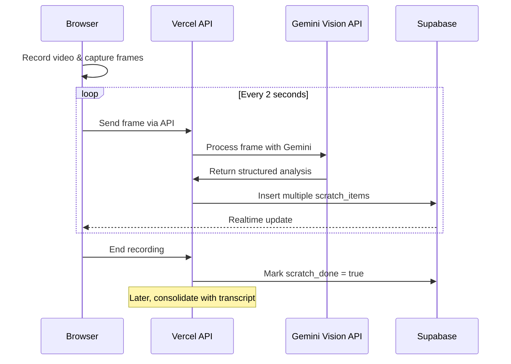

# Real-time Video Frame Analysis

This document describes the implementation of real-time frame analysis during video recording in Padlox.

## Architecture Overview

The system captures frames from the video recording at regular intervals, analyzes them directly with Vercel Serverless Functions using Gemini Vision AI, and stores metadata about detected items for later consolidation with the audio transcript.



## Implementation Components

### 1. Frame Capture (Client Side)

The frame capture is implemented in the following client-side components:

- `utils/frame-grabber.ts`: Utility to extract a frame from a video element
- `utils/frame-sender.ts`: Manager for sending frames at regular intervals to the API
- `hooks/use-camera-core.ts`: Core camera hook with frame streaming support
- `components/camera-capture.tsx`: Main camera UI with real-time analysis option

Frame capture occurs at a configurable interval (default: 2 seconds) and sends each frame as a JPEG to the backend.

### 2. Frame Processing (Server Side)

The backend processing includes:

- `app/api/frame/route.ts`: API route for receiving and directly processing frames
- `utils/frame-processor.ts`: Utility for processing frames with Gemini and storing results
- `app/api/session/complete/route.ts`: API for marking frame processing as complete
- `components/frame-analysis-display.tsx`: Component for displaying analysis results

### 3. Database Schema

```sql
-- Stores captured frames and their analysis
CREATE TABLE scratch_items (
  id UUID PRIMARY KEY DEFAULT gen_random_uuid(),
  session_id UUID NOT NULL REFERENCES sessions(id) ON DELETE CASCADE,
  captured_at TIMESTAMPTZ NOT NULL DEFAULT now(),
  caption TEXT NOT NULL,
  description TEXT,
  category TEXT,
  estimated_value NUMERIC,
  confidence REAL,
  image_url TEXT NOT NULL,
  bounding_box JSON,
  sequence_order INTEGER
);

-- Flag to indicate whether frame capture is complete
ALTER TABLE sessions ADD COLUMN scratch_done BOOLEAN DEFAULT FALSE;
```

## Configuration

The system is configured using environment variables:

| Variable | Description | Default |
|----------|-------------|---------|
| `NEXT_PUBLIC_FRAME_RATE_SEC` | Seconds between frame captures | `2` |
| `NEXT_PUBLIC_FRAME_API_URL` | API endpoint for frames | `/api/frame` |
| `GOOGLE_GENERATIVE_AI_API_KEY` | API key for Gemini | - |

## Implementation Flow

1. **Initialization**: When recording starts, if `realTimeAnalysis` is enabled, create a new `FrameSender` instance
2. **Frame Capture**: Every `FRAME_RATE_SEC` seconds, grab a frame from the video preview
3. **Frame Upload**: Send the frame to the API endpoint as form data
4. **Direct Processing**: Vercel function processes the frame with Gemini Vision AI directly
5. **Multi-item Recognition**: Gemini identifies multiple items in each frame
6. **Storage**: Store each item in the `scratch_items` table
7. **Finalization**: When recording stops, mark `scratch_done = true` in the session
8. **Consolidation**: After transcription completes, merge the transcript with frame analysis

## Real-time UI Updates

The UI receives real-time updates of processed frames via Supabase Realtime using `FrameAnalysisDisplay` component:

```typescript
// Subscription to frame analysis updates
const channel = supabase
  .channel('scratch-items')
  .on('postgres_changes', { 
    event: 'INSERT', 
    schema: 'public', 
    table: 'scratch_items',
    filter: `session_id=eq.${sessionId}` 
  }, (payload) => {
    // Update UI with new item
    setItems(prev => [...prev, payload.new]);
  })
  .subscribe();
```

## Transcript Consolidation

When both video processing and frame analysis are complete, a final consolidation step merges:

1. The speech transcript from the audio
2. The visual analysis from captured frames
3. LLM-based deduplication and enhancement

The final result is a comprehensive inventory that combines both audio narration and visual analysis.

## Implementation Advantages

- **Simplicity**: Direct processing in Vercel functions eliminates the need for additional infrastructure
- **Multi-item detection**: Each frame can generate multiple inventory items
- **Cost-effectiveness**: Ideal for low-volume applications without requiring extra services
- **Quick setup**: Faster to implement with fewer moving parts
- **Detailed metadata**: Each item includes description, category, and estimated value

## Future Improvements

- Adaptive frame rate based on motion detection
- Real-time guidance for users based on frame analysis
- Integration with additional vision models for specialized object detection 