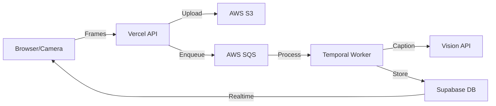

# Padlox Real-time Frame Analysis Implementation Plan

## Architecture Overview

The real-time frame analysis feature captures video frames during recording, analyzes them with AI vision models, and later merges results with audio transcripts for comprehensive item inventory.



## Database Schema Integration

### Current Database Schema

Looking at our existing schema in `lib/db/schema.ts`, we already have:
- `assets` table for videos and images
- `webhook_events` table for tracking Mux events
- `broadcast` table for realtime events

### New Schema Requirements

For real-time frame analysis, we need:
1. A table to store frame analysis data
2. A way to track when frame analysis is complete

We will create a migration file to add these components to our database.

## Implementation Steps

### 1. Database Migration

Create a new migration file at `migrations/20240523_add_frame_analysis.sql`:

```sql
-- Create scratch_items table
CREATE TABLE IF NOT EXISTS scratch_items (
  id UUID PRIMARY KEY DEFAULT gen_random_uuid(),
  asset_id UUID NOT NULL REFERENCES public.assets(id) ON DELETE CASCADE,
  captured_at TIMESTAMPTZ NOT NULL DEFAULT now(),
  caption TEXT,
  image_url TEXT NOT NULL,
  confidence REAL,
  
  -- Add index for quick lookups by asset
  CONSTRAINT fk_asset FOREIGN KEY (asset_id) REFERENCES public.assets(id)
);

CREATE INDEX IF NOT EXISTS idx_scratch_items_asset ON scratch_items(asset_id);

-- Add frame_analysis_complete flag to assets table
ALTER TABLE IF EXISTS public.assets 
ADD COLUMN IF NOT EXISTS frame_analysis_complete BOOLEAN DEFAULT FALSE;

-- Create a function to notify clients of new scratch items via Supabase Realtime
CREATE OR REPLACE FUNCTION notify_scratch_item_inserted()
RETURNS TRIGGER AS $$
BEGIN
  PERFORM pg_notify(
    'scratch_item_inserted',
    json_build_object(
      'id', NEW.id,
      'asset_id', NEW.asset_id,
      'captured_at', NEW.captured_at,
      'caption', NEW.caption,
      'image_url', NEW.image_url,
      'confidence', NEW.confidence
    )::text
  );
  RETURN NEW;
END;
$$ LANGUAGE plpgsql;

-- Create trigger to call the notification function
DROP TRIGGER IF EXISTS scratch_item_inserted_trigger ON scratch_items;
CREATE TRIGGER scratch_item_inserted_trigger
AFTER INSERT ON scratch_items
FOR EACH ROW
EXECUTE FUNCTION notify_scratch_item_inserted();
```

### 2. Update TypeScript Schema

Update `lib/db/schema.ts` to include our new table and field:

```typescript
// Add to Database interface under public.Tables
scratch_items: {
    Row: {
        id: string
        asset_id: string
        captured_at: string
        caption: string | null
        image_url: string
        confidence: number | null
    }
    Insert: {
        id?: string
        asset_id: string
        captured_at?: string
        caption?: string | null
        image_url: string
        confidence?: number | null
    }
    Update: {
        id?: string
        asset_id?: string
        captured_at?: string
        caption?: string | null
        image_url?: string
        confidence?: number | null
    }
}

// Add to assets table in Row, Insert, and Update
frame_analysis_complete: boolean
```

### 3. AWS Infrastructure Setup

1. **Create S3 bucket**
   ```bash
   aws s3 mb s3://padlox-frames --region us-east-1
   aws s3api put-bucket-cors --bucket padlox-frames --cors-configuration file://cors.json
   ```

2. **Create SQS queue**
   ```bash
   aws sqs create-queue --queue-name padlox-frame-queue
   ```

3. **Set up IAM permissions**
   ```bash
   aws iam create-role --role-name padlox-worker-role --assume-role-policy-document file://trust-policy.json
   aws iam attach-role-policy --role-name padlox-worker-role --policy-arn arn:aws:iam::aws:policy/AmazonSQSFullAccess
   aws iam attach-role-policy --role-name padlox-worker-role --policy-arn arn:aws:iam::aws:policy/AmazonS3FullAccess
   ```

### 4. Temporal Worker Implementation

1. **Create worker directory structure**
   ```
   padlox/
   ├── temporal/
   │   ├── activities/
   │   │   └── caption-frame.ts
   │   ├── workflows/
   │   │   └── consolidate-asset.ts
   │   ├── worker.ts
   │   └── package.json
   ```

2. **Implement caption frame activity**
   ```typescript
   // temporal/activities/caption-frame.ts
   export const captionFrame = defineActivity<{
     asset_id: string;
     frame_url: string;
   }, void>(async ({ asset_id, frame_url }) => {
     // Call vision API for frame caption
     const { caption, confidence } = await callVisionModel(frame_url);
     
     // Insert result to database
     await supabase.from('scratch_items').insert({
       asset_id,
       caption,
       image_url: frame_url,
       confidence
     });
   });
   ```

3. **Implement SQS polling**
   ```typescript
   // temporal/worker.ts
   function startSQSPolling() {
     const sqs = new AWS.SQS();
     setInterval(async () => {
       const result = await sqs.receiveMessage({
         QueueUrl: process.env.SQS_QUEUE_URL,
         MaxNumberOfMessages: 10
       }).promise();
       
       if (result.Messages) {
         for (const message of result.Messages) {
           const payload = JSON.parse(message.Body);
           await captionFrame(payload);
           await sqs.deleteMessage({
             QueueUrl: process.env.SQS_QUEUE_URL,
             ReceiptHandle: message.ReceiptHandle
           }).promise();
         }
       }
     }, 1000);
   }
   ```

### 5. Update Frame Route API

We need to modify the API endpoint to work with our assets table:

```typescript
// app/api/frame/route.ts
export async function POST(req: NextRequest) {
  const { searchParams } = new URL(req.url);
  const assetId = searchParams.get('asset');
  
  if (!assetId) {
    return Response.json({ error: 'Missing asset ID' }, { status: 400 });
  }
  
  // Verify asset exists
  const { data: asset, error } = await supabase
    .from('assets')
    .select('id')
    .eq('id', assetId)
    .single();
  
  if (error || !asset) {
    console.error('Invalid asset ID:', assetId, error);
    return Response.json({ error: 'Invalid asset ID' }, { status: 404 });
  }
  
  // Get frame data from request
  const frameData = await req.arrayBuffer();
  
  try {
    // Process the frame
    await processFrame(frameData, assetId);
    return Response.json({ success: true });
  } catch (error) {
    console.error('Error processing frame:', error);
    return Response.json({ error: 'Failed to process frame' }, { status: 500 });
  }
}
```

### 6. Modify Camera Hook

Update the useCameraCore hook to use assetId instead of sessionId:

```typescript
// In startRecording() function
if (realTimeAnalysis && asset_id) {
  const wsUrl = process.env.NEXT_PUBLIC_FRAME_WS_URL || '/api/frame';
  frameSenderRef.current = new FrameSender(videoRef.current!, {
    wsUrl,
    assetId: asset_id, // Use asset ID instead of session ID
    frameRateSec: parseInt(process.env.NEXT_PUBLIC_FRAME_RATE_SEC || '2', 10),
    onError: (error) => {
      console.warn('Frame sender error:', error);
    }
  });
  
  frameSenderRef.current.start();
}
```

### 7. Integration with Transcript Workflow

Modify the consolidation workflow to work with our assets table:

```typescript
// temporal/workflows/consolidate-asset.ts
export async function consolidateAsset(assetId: string) {
  // 1. Get transcript from assets.transcript
  const { data: asset } = await supabase
    .from('assets')
    .select('transcript_text')
    .eq('id', assetId)
    .single();
  
  const transcript = asset?.transcript_text;
  
  // 2. Wait for frame analysis completion
  await waitForFrameAnalysisComplete(assetId);
  
  // 3. Get all scratch items
  const { data: scratchItems } = await supabase
    .from('scratch_items')
    .select('*')
    .eq('asset_id', assetId);
  
  // 4. Merge transcript with visual data using LLM
  const mergedItems = await mergeWithLLM(transcript, scratchItems);
  
  // 5. Store final items as new assets with media_type: 'item'
  for (const item of mergedItems) {
    await supabase.from('assets').insert({
      user_id: (await getUserFromAsset(assetId)).id,
      name: item.label,
      description: item.detailedDescription,
      estimated_value: item.estValueUSD,
      media_url: item.imageUrl,
      media_type: 'item',
      is_signed: false,
      is_source_video: false,
      source_video_id: assetId,
      is_processed: true
    });
  }
  
  // 6. Mark the asset as processed
  await supabase
    .from('assets')
    .update({ is_processed: true })
    .eq('id', assetId);
}
```

### 8. Vercel Configuration

1. **Add `.vercelignore` file** to exclude worker code from Vercel deployments
   ```
   # .vercelignore
   temporal/
   ```

### 9. Worker Deployment

1. **Deploy worker to AWS Lambda or EC2**
   ```bash
   # For Lambda
   cd temporal
   npm run build
   zip -r worker.zip dist node_modules
   aws lambda create-function \
     --function-name padlox-frame-processor \
     --runtime nodejs18.x \
     --handler dist/worker.handler \
     --zip-file fileb://worker.zip \
     --role arn:aws:iam::ACCOUNT_ID:role/padlox-worker-role \
     --environment Variables="{SQS_QUEUE_URL=https://sqs.us-east-1.amazonaws.com/ACCOUNT_ID/padlox-frame-queue,SUPABASE_URL=...,SUPABASE_KEY=...}"
   ```

2. **Configure Lambda to poll SQS**
   ```bash
   aws lambda create-event-source-mapping \
     --function-name padlox-frame-processor \
     --event-source-arn arn:aws:sqs:us-east-1:ACCOUNT_ID:padlox-frame-queue
   ```

## Testing and Validation

1. **Local testing setup**
   ```bash
   # Run Temporal locally
   git clone https://github.com/temporalio/docker-compose.git
   cd docker-compose
   docker compose up
   
   # Run LocalStack for AWS services
   docker run -d -p 4566:4566 localstack/localstack
   
   # Configure local environment
   export TEMPORAL_URL=localhost:7233
   export AWS_ENDPOINT=http://localhost:4566
   export SQS_QUEUE_URL=http://localhost:4566/queue/padlox-frame-queue
   ```

2. **Run worker locally**
   ```bash
   cd temporal
   npm run dev
   ```

3. **Test end-to-end flow**
   - Record video in the app with real-time analysis enabled
   - Verify frames are sent to API
   - Check SQS for messages
   - Confirm worker processes frames
   - Validate entries in scratch_items table

## Environment Variables

```
# Vercel environment variables
NEXT_PUBLIC_FRAME_WS_URL=/api/frame
NEXT_PUBLIC_FRAME_RATE_SEC=2

# Worker environment variables
AWS_REGION=us-east-1
AWS_ACCESS_KEY_ID=xxx
AWS_SECRET_ACCESS_KEY=xxx
S3_BUCKET_NAME=padlox-frames
SQS_FRAME_QUEUE_URL=https://sqs.us-east-1.amazonaws.com/ACCOUNT_ID/padlox-frame-queue
SUPABASE_URL=xxx
SUPABASE_SERVICE_ROLE_KEY=xxx
VISION_API_KEY=xxx
```

## Future Enhancements

- **Adaptive frame rate** based on motion detection
- **Enhanced vision models** for item detection and classification
- **Real-time guidance** based on frame analysis
- **Automatic report generation** from merged data
- **Horizontal scaling** for workers during high load 