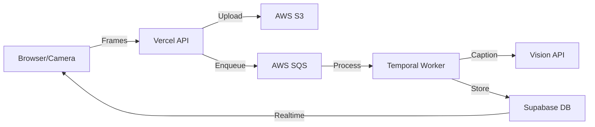

# Padlox Real-time Frame Analysis Implementation Plan

## Architecture Overview

The Padlox real-time frame analysis feature captures video frames during recording, analyzes them with AI vision models, and later merges results with audio transcripts for comprehensive item inventory.



## Implementation Status

### ✅ Completed Components

- **Client-side frame capture**
  - `utils/frame-grabber.ts`: Utility to capture frames from video
  - `utils/frame-sender.ts`: WebSocket client to send frames
  - `hooks/use-camera-core.ts`: Integration with camera hook
  - `components/camera-capture.tsx`: UI integration
  - `components/camera/camera-view.tsx`: Real-time analysis indicator

- **API endpoint**
  - `app/api/frame/route.ts`: HTTP endpoint for receiving frames

- **Database schema**
  - `database/schema.sql`: Table definitions for `scratch_items`

### 🚧 Next Steps

## 1. AWS Infrastructure Setup

1. **Create S3 bucket**
   ```bash
   aws s3 mb s3://padlox-frames --region us-east-1
   aws s3api put-bucket-cors --bucket padlox-frames --cors-configuration file://cors.json
   ```

2. **Create SQS queue**
   ```bash
   aws sqs create-queue --queue-name padlox-frame-queue
   ```

3. **Set up IAM permissions**
   ```bash
   aws iam create-role --role-name padlox-worker-role --assume-role-policy-document file://trust-policy.json
   aws iam attach-role-policy --role-name padlox-worker-role --policy-arn arn:aws:iam::aws:policy/AmazonSQSFullAccess
   aws iam attach-role-policy --role-name padlox-worker-role --policy-arn arn:aws:iam::aws:policy/AmazonS3FullAccess
   ```

## 2. Temporal Worker Implementation

1. **Create worker directory structure**
   ```
   padlox/
   ├── temporal/
   │   ├── activities/
   │   │   └── caption-frame.ts
   │   ├── workflows/
   │   │   └── consolidate-session.ts
   │   ├── worker.ts
   │   └── package.json
   ```

2. **Implement caption frame activity**
   ```typescript
   // temporal/activities/caption-frame.ts
   export const captionFrame = defineActivity<{
     session_id: string;
     frame_url: string;
   }, void>(async ({ session_id, frame_url }) => {
     // Call vision API for frame caption
     const { caption, confidence } = await callVisionModel(frame_url);
     
     // Insert result to database
     await supabase.from('scratch_items').insert({
       session_id,
       caption,
       image_url: frame_url,
       confidence
     });
   });
   ```

3. **Implement SQS polling**
   ```typescript
   // temporal/worker.ts
   function startSQSPolling() {
     const sqs = new AWS.SQS();
     setInterval(async () => {
       const result = await sqs.receiveMessage({
         QueueUrl: process.env.SQS_QUEUE_URL,
         MaxNumberOfMessages: 10
       }).promise();
       
       if (result.Messages) {
         for (const message of result.Messages) {
           const payload = JSON.parse(message.Body);
           await captionFrame(payload);
           await sqs.deleteMessage({
             QueueUrl: process.env.SQS_QUEUE_URL,
             ReceiptHandle: message.ReceiptHandle
           }).promise();
         }
       }
     }, 1000);
   }
   ```

## 3. Vercel Configuration

1. **Add `.vercelignore` file** to exclude worker code from Vercel deployments
   ```
   # .vercelignore
   temporal/
   ```

## 4. Worker Deployment

1. **Deploy worker to AWS Lambda or EC2**
   ```bash
   # For Lambda
   cd temporal
   npm run build
   zip -r worker.zip dist node_modules
   aws lambda create-function \
     --function-name padlox-frame-processor \
     --runtime nodejs18.x \
     --handler dist/worker.handler \
     --zip-file fileb://worker.zip \
     --role arn:aws:iam::ACCOUNT_ID:role/padlox-worker-role \
     --environment Variables="{SQS_QUEUE_URL=https://sqs.us-east-1.amazonaws.com/ACCOUNT_ID/padlox-frame-queue,SUPABASE_URL=...,SUPABASE_KEY=...}"
   ```

2. **Configure Lambda to poll SQS**
   ```bash
   aws lambda create-event-source-mapping \
     --function-name padlox-frame-processor \
     --event-source-arn arn:aws:sqs:us-east-1:ACCOUNT_ID:padlox-frame-queue
   ```

## 5. Testing and Validation

1. **Local testing setup**
   ```bash
   # Run Temporal locally
   git clone https://github.com/temporalio/docker-compose.git
   cd docker-compose
   docker compose up
   
   # Run LocalStack for AWS services
   docker run -d -p 4566:4566 localstack/localstack
   
   # Configure local environment
   export TEMPORAL_URL=localhost:7233
   export AWS_ENDPOINT=http://localhost:4566
   export SQS_QUEUE_URL=http://localhost:4566/queue/padlox-frame-queue
   ```

2. **Run worker locally**
   ```bash
   cd temporal
   npm run dev
   ```

3. **Test end-to-end flow**
   - Record video in the app with real-time analysis enabled
   - Verify frames are sent to API
   - Check SQS for messages
   - Confirm worker processes frames
   - Validate entries in scratch_items table

## 6. Integration with Transcript Workflow

1. **Implement consolidation workflow**
   ```typescript
   // temporal/workflows/consolidate-session.ts
   export async function consolidateSession(sessionId: string) {
     // 1. Get transcript
     const transcript = await activities.getTranscript(sessionId);
     
     // 2. Wait for scratch items completion
     await activities.waitForScratchDone(sessionId);
     
     // 3. Get all scratch items
     const scratchItems = await activities.getScratchItems(sessionId);
     
     // 4. Merge transcript with visual data using LLM
     const mergedItems = await activities.mergeWithLLM(transcript, scratchItems);
     
     // 5. Store final items
     await activities.storeFinalItems(sessionId, mergedItems);
   }
   ```

## Environment Variables

```
# Vercel environment variables
NEXT_PUBLIC_FRAME_WS_URL=/api/frame
NEXT_PUBLIC_FRAME_RATE_SEC=2

# Worker environment variables
AWS_REGION=us-east-1
AWS_ACCESS_KEY_ID=xxx
AWS_SECRET_ACCESS_KEY=xxx
S3_BUCKET_NAME=padlox-frames
SQS_FRAME_QUEUE_URL=https://sqs.us-east-1.amazonaws.com/ACCOUNT_ID/padlox-frame-queue
SUPABASE_URL=xxx
SUPABASE_SERVICE_ROLE_KEY=xxx
VISION_API_KEY=xxx
```

## Future Enhancements

- **Adaptive frame rate** based on motion detection
- **Enhanced vision models** for item detection and classification
- **Real-time guidance** based on frame analysis
- **Automatic report generation** from merged data
- **Horizontal scaling** for workers during high load
