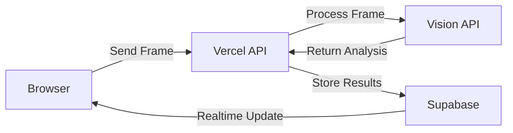

# Implementing Real-time Frame Analysis with Vercel Functions

This guide provides step-by-step instructions for implementing real-time frame analysis using Vercel Functions directly, without requiring Temporal, AWS SQS, or S3. This approach is ideal for simpler implementations and lower volumes of analysis.

## Architecture Overview

In this approach, we'll capture frames from the browser, send them directly to a Vercel API endpoint, process them with a vision model, and store the results in Supabase.



## Prerequisites

- Next.js project deployed on Vercel
- Supabase project with appropriate tables set up
- Access to a Vision API (OpenAI, Google Vision, etc.)

## Implementation Steps

### 1. Database Setup

First, create the necessary tables in your Supabase database:

```sql
-- Create scratch_items table for storing frame analysis
CREATE TABLE scratch_items (
  id UUID PRIMARY KEY DEFAULT gen_random_uuid(),
  session_id UUID NOT NULL REFERENCES sessions(id),
  captured_at TIMESTAMPTZ NOT NULL DEFAULT now(),
  caption TEXT,
  image_url TEXT NOT NULL,
  confidence REAL,
  
  -- Add foreign key constraint
  CONSTRAINT fk_session FOREIGN KEY (session_id) REFERENCES sessions(id) ON DELETE CASCADE
);

-- Create index for quick lookups
CREATE INDEX idx_scratch_items_session ON scratch_items(session_id);

-- Add scratch_done flag to sessions table
ALTER TABLE sessions ADD COLUMN IF NOT EXISTS scratch_done BOOLEAN DEFAULT FALSE;

-- Add realtime notifications for frame analysis
CREATE OR REPLACE FUNCTION notify_scratch_item_inserted()
RETURNS TRIGGER AS $$
BEGIN
  PERFORM pg_notify(
    'scratch_item_inserted',
    json_build_object(
      'id', NEW.id,
      'session_id', NEW.session_id,
      'caption', NEW.caption,
      'image_url', NEW.image_url
    )::text
  );
  RETURN NEW;
END;
$$ LANGUAGE plpgsql;

-- Create trigger for notifications
CREATE TRIGGER scratch_item_inserted_trigger
AFTER INSERT ON scratch_items
FOR EACH ROW
EXECUTE FUNCTION notify_scratch_item_inserted();
```

### 2. Frame Capture Utility

Create a utility for capturing frames from the video element:

```typescript
// utils/frame-grabber.ts
/**
 * Captures a frame from a video element
 * @param video HTML video element to capture from
 * @param size Target width for the captured frame
 * @param quality JPEG quality (0-1)
 * @returns Promise resolving to a Blob containing the frame as JPEG
 */
export async function grabFrame(
  video: HTMLVideoElement,
  size: number = 512,
  quality: number = 0.8
): Promise<Blob> {
  // Create canvas element
  const canvas = document.createElement('canvas');
  const ctx = canvas.getContext('2d');
  
  if (!ctx) {
    throw new Error('Failed to get canvas context');
  }
  
  // Calculate dimensions maintaining aspect ratio
  const aspectRatio = video.videoWidth / video.videoHeight;
  const width = size;
  const height = Math.round(width / aspectRatio);
  
  // Set canvas size and draw frame
  canvas.width = width;
  canvas.height = height;
  ctx.drawImage(video, 0, 0, width, height);
  
  // Convert to blob (JPEG)
  return new Promise((resolve, reject) => {
    canvas.toBlob(
      (blob) => {
        if (blob) {
          resolve(blob);
        } else {
          reject(new Error('Failed to create blob from canvas'));
        }
      },
      'image/jpeg',
      quality
    );
  });
}
```

### 3. Frame Sender Utility

Create a utility for sending frames at regular intervals:

```typescript
// utils/frame-sender.ts
import { grabFrame } from './frame-grabber';

export interface FrameSenderOptions {
  apiUrl: string;
  sessionId: string;
  frameRateSec?: number;
  frameSize?: number;
  quality?: number;
  onFrameCaptured?: (frame: Blob) => void;
  onError?: (error: Error) => void;
}

/**
 * Manages sending frames to the backend at regular intervals
 */
export class FrameSender {
  private videoElement: HTMLVideoElement;
  private options: FrameSenderOptions;
  private intervalId: number | null = null;
  private isSending = false;
  
  constructor(videoElement: HTMLVideoElement, options: FrameSenderOptions) {
    this.videoElement = videoElement;
    this.options = {
      frameRateSec: 2,
      frameSize: 512,
      quality: 0.8,
      ...options
    };
  }
  
  /**
   * Start sending frames
   */
  public start(): void {
    if (this.intervalId !== null) {
      this.stop();
    }
    
    this.isSending = true;
    
    // Capture and send frames at the specified interval
    this.intervalId = window.setInterval(
      () => this.captureAndSendFrame(),
      (this.options.frameRateSec || 2) * 1000
    );
    
    // Immediately capture first frame
    this.captureAndSendFrame();
  }
  
  /**
   * Stop sending frames and cleanup
   */
  public stop(): void {
    if (this.intervalId !== null) {
      window.clearInterval(this.intervalId);
      this.intervalId = null;
    }
    this.isSending = false;
  }
  
  /**
   * Capture a frame and send it to the API
   */
  private async captureAndSendFrame(): Promise<void> {
    if (!this.isSending || !this.videoElement) {
      return;
    }
    
    try {
      // Capture frame
      const frame = await grabFrame(
        this.videoElement,
        this.options.frameSize,
        this.options.quality
      );
      
      // Invoke optional callback
      if (this.options.onFrameCaptured) {
        this.options.onFrameCaptured(frame);
      }
      
      // Send frame to API
      await this.sendFrame(frame);
    } catch (error) {
      if (this.options.onError) {
        this.options.onError(error as Error);
      } else {
        console.error('Error capturing or sending frame:', error);
      }
    }
  }
  
  /**
   * Send a frame to the API
   */
  private async sendFrame(frame: Blob): Promise<void> {
    const formData = new FormData();
    formData.append('frame', frame, 'frame.jpg');
    
    const response = await fetch(`${this.options.apiUrl}?session=${this.options.sessionId}`, {
      method: 'POST',
      body: formData,
    });
    
    if (!response.ok) {
      throw new Error(`Failed to send frame: ${response.status} ${response.statusText}`);
    }
  }
}
```

### 4. Vision API Utility

Create a utility for processing frames with your vision model of choice:

```typescript
// utils/vision-api.ts
import { createClient } from '@supabase/supabase-js';
import { Database } from '@/lib/db/schema';

// Configure Supabase client
const supabaseUrl = process.env.NEXT_PUBLIC_SUPABASE_URL || '';
const supabaseServiceKey = process.env.SUPABASE_SERVICE_ROLE_KEY || '';
const supabase = createClient<Database>(supabaseUrl, supabaseServiceKey);

// Configure vision API
const VISION_API_ENDPOINT = process.env.VISION_API_ENDPOINT || 'https://api.openai.com/v1/chat/completions';
const VISION_API_KEY = process.env.VISION_API_KEY || '';

/**
 * Process an image with vision API and store results
 * @param imageData Binary image data to process
 * @param sessionId ID of the session this frame belongs to
 * @returns Promise that resolves when processing is complete
 */
export async function processImage(imageData: ArrayBuffer, sessionId: string): Promise<void> {
  try {
    // Convert image to base64 for storage and API processing
    const base64Image = Buffer.from(imageData).toString('base64');
    const imageUrl = `data:image/jpeg;base64,${base64Image}`;
    
    // Call vision API to generate caption
    const caption = await generateCaption(imageUrl);
    
    // Calculate confidence score (simple example)
    const confidence = calculateConfidence(caption);
    
    // Store the results in the database
    await storeResults(sessionId, imageUrl, caption, confidence);
    
    console.log(`Frame processed successfully for session ${sessionId}`);
  } catch (error) {
    console.error('Error processing image:', error);
    throw error;
  }
}

/**
 * Generate a caption for an image using vision model
 * @param imageUrl Image URL or data URL to analyze
 * @returns Caption text from the vision model
 */
async function generateCaption(imageUrl: string): Promise<string> {
  // This example uses OpenAI's API, but you can use any vision API
  const response = await fetch(VISION_API_ENDPOINT, {
    method: 'POST',
    headers: {
      'Content-Type': 'application/json',
      'Authorization': `Bearer ${VISION_API_KEY}`
    },
    body: JSON.stringify({
      model: 'gpt-4-vision-preview',
      messages: [
        {
          role: 'user',
          content: [
            {
              type: 'text',
              text: 'Describe this image in a concise sentence, focusing on visible objects and items.'
            },
            {
              type: 'image_url',
              image_url: { url: imageUrl }
            }
          ]
        }
      ],
      max_tokens: 100
    })
  });
  
  if (!response.ok) {
    throw new Error(`Vision API error: ${response.status} ${response.statusText}`);
  }
  
  const data = await response.json();
  return data.choices[0].message.content.trim();
}

/**
 * Simple confidence calculation based on caption length and content
 * In a real implementation, you might get this from the API directly
 */
function calculateConfidence(caption: string): number {
  // Simple heuristic for demo purposes
  if (!caption) return 0;
  
  // Higher confidence for longer, more detailed captions
  const length = Math.min(caption.length / 100, 1); // Up to 1.0 for length
  
  // Higher confidence if caption contains specific object words
  const hasDetailedObjects = /table|chair|sofa|cabinet|desk|computer|phone|tv|television|lamp|plant|book|painting|rug|carpet|bed|couch/i.test(caption);
  
  return Math.min((length * 0.6) + (hasDetailedObjects ? 0.4 : 0.1), 1.0);
}

/**
 * Store analysis results in database
 */
async function storeResults(
  sessionId: string,
  imageUrl: string,
  caption: string,
  confidence: number
): Promise<void> {
  // Store in Supabase
  const { error } = await supabase.from('scratch_items').insert({
    session_id: sessionId,
    image_url: imageUrl,
    caption,
    confidence,
    captured_at: new Date().toISOString()
  });
  
  if (error) {
    throw new Error(`Failed to store results: ${error.message}`);
  }
}
```

### 5. API Route Handler

Create an API endpoint to handle frame uploads:

```typescript
// app/api/frame/route.ts
import { NextRequest } from 'next/server';
import { processImage } from '@/utils/vision-api';

export const dynamic = 'force-dynamic';

/**
 * API route for processing video frames
 */
export async function POST(req: NextRequest) {
  // Get session ID from query params
  const { searchParams } = new URL(req.url);
  const sessionId = searchParams.get('session');
  
  if (!sessionId) {
    return Response.json({ error: 'Missing session ID' }, { status: 400 });
  }
  
  try {
    // Get frame data as form data
    const formData = await req.formData();
    const frameFile = formData.get('frame') as File;
    
    if (!frameFile) {
      return Response.json({ error: 'No frame provided' }, { status: 400 });
    }
    
    // Convert file to array buffer
    const frameBuffer = await frameFile.arrayBuffer();
    
    // Process the frame (this will also store results)
    await processImage(frameBuffer, sessionId);
    
    // Return success response
    return Response.json({ success: true });
  } catch (error) {
    console.error('Error processing frame:', error);
    return Response.json(
      { error: 'Failed to process frame', message: (error as Error).message },
      { status: 500 }
    );
  }
}
```

### 6. Camera Hook Integration

Update the camera hook to use the frame sender:

```typescript
// hooks/use-camera-core.ts
import { useRef, useState } from 'react';
import { FrameSender } from '@/utils/frame-sender';

interface UseCameraCoreProps {
  // Other props...
  realTimeAnalysis?: boolean;
}

export function useCameraCore({
  // Other props...
  realTimeAnalysis = false
}: UseCameraCoreProps) {
  // Existing camera state...
  const [isRecording, setIsRecording] = useState(false);
  const videoRef = useRef<HTMLVideoElement>(null);
  const frameSenderRef = useRef<FrameSender | null>(null);
  
  // Start recording function
  const startRecording = async (sessionId: string) => {
    // Existing code to start recording...
    
    // Start frame sender if real-time analysis is enabled
    if (realTimeAnalysis && videoRef.current && sessionId) {
      const apiUrl = process.env.NEXT_PUBLIC_FRAME_API_URL || '/api/frame';
      frameSenderRef.current = new FrameSender(videoRef.current, {
        apiUrl,
        sessionId,
        frameRateSec: parseInt(process.env.NEXT_PUBLIC_FRAME_RATE_SEC || '2', 10),
        onError: (error) => {
          console.warn('Frame sender error:', error);
        }
      });
      
      frameSenderRef.current.start();
    }
    
    setIsRecording(true);
  };
  
  // Stop recording function
  const stopRecording = async () => {
    // Existing code to stop recording...
    
    // Stop frame sender
    if (frameSenderRef.current) {
      frameSenderRef.current.stop();
      frameSenderRef.current = null;
    }
    
    setIsRecording(false);
    
    // Mark session as complete
    if (currentSessionId) {
      await fetch('/api/session/complete', {
        method: 'POST',
        headers: { 'Content-Type': 'application/json' },
        body: JSON.stringify({ sessionId: currentSessionId, scratchDone: true })
      });
    }
  };
  
  // Return values and functions...
}
```

### 7. Session Completion API

Create an API to mark the session as complete:

```typescript
// app/api/session/complete/route.ts
import { NextRequest } from 'next/server';
import { createClient } from '@supabase/supabase-js';
import { Database } from '@/lib/db/schema';

// Configure Supabase client
const supabaseUrl = process.env.NEXT_PUBLIC_SUPABASE_URL || '';
const supabaseServiceKey = process.env.SUPABASE_SERVICE_ROLE_KEY || '';
const supabase = createClient<Database>(supabaseUrl, supabaseServiceKey);

export async function POST(req: NextRequest) {
  try {
    const { sessionId, scratchDone } = await req.json();
    
    if (!sessionId) {
      return Response.json({ error: 'Missing session ID' }, { status: 400 });
    }
    
    // Update session
    const { error } = await supabase
      .from('sessions')
      .update({ scratch_done: scratchDone === true })
      .eq('id', sessionId);
    
    if (error) {
      throw new Error(`Failed to update session: ${error.message}`);
    }
    
    return Response.json({ success: true });
  } catch (error) {
    console.error('Error completing session:', error);
    return Response.json(
      { error: 'Failed to complete session', message: (error as Error).message },
      { status: 500 }
    );
  }
}
```

### 8. Realtime UI Updates

Add realtime updates with Supabase realtime:

```tsx
// components/frame-analysis-display.tsx
import { useEffect, useState } from 'react';
import { createClient } from '@supabase/supabase-js';
import { Database } from '@/lib/db/schema';

// Configure Supabase client
const supabaseUrl = process.env.NEXT_PUBLIC_SUPABASE_URL || '';
const supabaseKey = process.env.NEXT_PUBLIC_SUPABASE_ANON_KEY || '';
const supabase = createClient<Database>(supabaseUrl, supabaseKey);

interface ScratchItem {
  id: string;
  session_id: string;
  caption: string;
  image_url: string;
  confidence: number;
  captured_at: string;
}

interface Props {
  sessionId: string;
}

export function FrameAnalysisDisplay({ sessionId }: Props) {
  const [items, setItems] = useState<ScratchItem[]>([]);
  
  useEffect(() => {
    // Load existing items
    const loadItems = async () => {
      const { data, error } = await supabase
        .from('scratch_items')
        .select('*')
        .eq('session_id', sessionId)
        .order('captured_at', { ascending: true });
      
      if (!error && data) {
        setItems(data);
      }
    };
    
    loadItems();
    
    // Subscribe to realtime updates
    const channel = supabase
      .channel('scratch-items')
      .on('postgres_changes', {
        event: 'INSERT',
        schema: 'public',
        table: 'scratch_items',
        filter: `session_id=eq.${sessionId}`
      }, (payload) => {
        // Add new item to the list
        setItems(prev => [...prev, payload.new as ScratchItem]);
      })
      .subscribe();
    
    // Cleanup
    return () => {
      supabase.removeChannel(channel);
    };
  }, [sessionId]);
  
  return (
    <div className="frame-analysis-container">
      <h3>Analyzed Items ({items.length})</h3>
      <div className="frames-grid">
        {items.map(item => (
          <div key={item.id} className="frame-item">
            <div className="frame-image">
              
            </div>
            <div className="frame-caption">
              <p>{item.caption}</p>
              <span className="confidence">
                Confidence: {Math.round(item.confidence * 100)}%
              </span>
            </div>
          </div>
        ))}
      </div>
    </div>
  );
}
```

## Environment Variables

Create a `.env.local` file with the following variables:

```
# Frame Analysis Configuration
NEXT_PUBLIC_FRAME_API_URL=/api/frame
NEXT_PUBLIC_FRAME_RATE_SEC=2

# Vision API Configuration (using OpenAI as example)
VISION_API_ENDPOINT=https://api.openai.com/v1/chat/completions
VISION_API_KEY=your-api-key-here

# Supabase Configuration
NEXT_PUBLIC_SUPABASE_URL=your-supabase-url
NEXT_PUBLIC_SUPABASE_ANON_KEY=your-anon-key
SUPABASE_SERVICE_ROLE_KEY=your-service-role-key
```

## Handling Function Timeouts

Vercel serverless functions on the Hobby plan have a 10-second timeout limit. If your vision API processing exceeds this limit, consider these options:

1. **Client-side polling**: Have the client check for results after submitting a frame.
2. **Background processing**: Split into two functions - one that accepts frames and one that processes them.
3. **Adjust frame rate**: Increase interval between frames to reduce system load.
4. **Upgrade to paid plan**: The Pro plan offers longer function execution times (up to 60 seconds).

## Scaling Considerations

As your usage grows, you might encounter limitations with the direct Vercel approach:

1. **Function timeout**: For complex analysis that takes longer than the Vercel function limit.
2. **Rate limiting**: Vision APIs often have rate limits you might hit with many concurrent users.
3. **Memory usage**: Processing larger images may exceed function memory limits.

When you reach these limits, consider transitioning to the more robust architecture with SQS, S3, and Temporal for greater reliability and scalability.

## Conclusion

This implementation provides a straightforward approach to real-time frame analysis using only Vercel Functions and Supabase, making it ideal for projects with moderate volumes and simpler requirements. For projects with higher throughput needs or more complex workflows, consider migrating to the AWS+Temporal approach documented in other guides. 